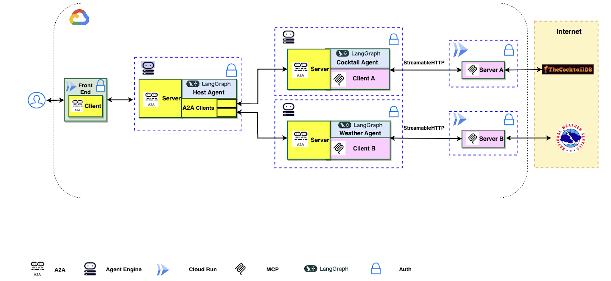
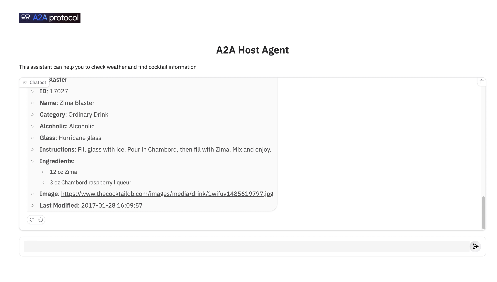

# A2A Multi-Agent on Agent Engine

> **⚠️ DISCLAIMER**: THIS DEMO IS INTENDED FOR DEMONSTRATION PURPOSES ONLY. IT IS NOT INTENDED FOR USE IN A PRODUCTION ENVIRONMENT.
>
> **⚠️ Important**: A2A is a work in progress (WIP) thus, in the near future there might be changes that are different from what demonstrated here.

 > **⚠️ Important**: Please run it in **Cloud Shell** to ensure you have the proper permissions.

This document describes a multi-agent set up using Agent2Agent (A2A), LangGraph, Agent Engine, MCP servers, and the LangGraph extension for A2A. It provides an overview of how the A2A protocol works between agents, and how the extension is activated on the server and included in the response.

## Overview

This document describes a web application demonstrating the integration of Google's Open Source frameworks Agent2Agent (A2A) and LangGraph for multi-agent orchestration with Model Context Protocol (MCP) clients. The application features a host agent coordinating tasks between specialized remote A2A agents that interact with various MCP servers to fulfill user requests.

### Architecture

The application utilizes a multi-agent architecture where a host agent delegates tasks to remote A2A agents (Cocktail and Weather) based on the user's query. These agents then interact with corresponding remote MCP servers.

**Host Agent is built using A2A Server.**




### Application Screenshot



## Core Components

### Agents

The application employs three distinct agents:

- **Host Agent:** The main entry point that receives user queries, determines the required task(s), and delegates to the appropriate specialized agent(s).
- **Cocktail Agent:** Handles requests related to cocktail recipes and ingredients by interacting with the Cocktail MCP server.
- **Weather Agent:** Manages requests related to weather forecasts by interacting with the Weather MCP servers.

### MCP Servers and Tools

The agents interact with the following MCP servers:

1.  **Cocktail MCP Server** (Local Code)
    - Provides 5 tools:
        - `search cocktail by name`
        - `list all cocktail by first letter`
        - `search ingredient by name`
        - `list random cocktails`
        - `lookup full cocktail details by id`
2.  **Weather MCP Server** (Local Code)
    - Provides 3 tools:
        - `get weather forecast by city name`
        - `get weather forecast by coordinates`
        - `get weather alert by state code`

## Example Usage

Here are some example questions you can ask the chatbot:

- `Please get cocktail margarita id and then full detail of cocktail margarita`
- `Please list a random cocktail`
- `Please get weather forecast for New York`
- `Please get weather forecast for 40.7128,-74.0060`

## Setup and Deployment

### Prerequisites

Before running the application locally or setting up CI/CD, ensure you have the following installed:

1.  [Python 3.12+](https://www.python.org/downloads/)
2.  [gcloud SDK](https://cloud.google.com/sdk/docs/install)
3.  [uv](https://docs.astral.sh/uv/getting-started/installation/) (The Python package management tool used in this project)
4.  [Terraform](https://developer.hashicorp.com/terraform/downloads) (For infrastructure provisioning)
5.  [GitHub CLI (gh)](https://cli.github.com/) (Required for automated CI/CD setup)
6.  [Docker](https://docs.docker.com/get-docker/) (For local container builds)

### CI/CD Pipeline Setup

This project uses **GitHub Actions** for continuous integration and deployment. The infrastructure is managed by **Terraform**.

To automatically set up the CI/CD pipeline, repository, and infrastructure, use the `agent-starter-pack`:

1.  **Environment Setup**:
    *   Authenticate with Google Cloud:
        ```bash
        gcloud auth login
        gcloud auth application-default login
        ```
    *   Authenticate with GitHub CLI:
        ```bash
        gh auth login
        ```
    *   Create and activate a virtual environment, then install dependencies:
        ```bash
        uv venv
        source .venv/bin/activate
        uv pip install agent-starter-pack --extra-index-url https://us-python.pkg.dev/artifact-foundry-prod/ah-3p-staging-python/simple/
        ```

2.  **Run CI/CD Setup**:
    Navigate to the root of the project and run the setup command. Replace the project IDs and repository details with your own:
    ```bash
    agent-starter-pack setup-cicd \
      --dev-project YOUR_DEV_PROJECT_ID \
      --staging-project YOUR_STAGING_PROJECT_ID \
      --prod-project YOUR_PROD_PROJECT_ID \
      --repository-name YOUR_REPO_NAME \
      --repository-owner YOUR_GITHUB_USERNAME \
      --cicd-runner github_actions
    ```

3.  **GitHub Actions Workflow**:
    Once the setup is complete, the workflow defined in `.github/workflows/deploy.yml` takes over. It triggers on pushes to:
    -   `staging`: Deploys to the staging environment (Project: `YOUR_STAGING_PROJECT_ID`).
    -   `main`: Deploys to the production environment (Project: `YOUR_PROD_PROJECT_ID`).

    The pipeline performs the following steps:
    1.  **Detect Changes**: Identifies which components (MCP servers, agents, frontend, infrastructure) have changed.
    2.  **Deploy MCP Servers**: Builds and deploys the Cocktail and Weather MCP servers to Cloud Run.
    3.  **Deploy Agents**: Uses `deployment/deploy_agents.py` to deploy the A2A agents (Hosting, Cocktail, Weather) to Vertex AI Agent Engine.
    4.  **Deploy Frontend**: Builds and deploys the frontend application to Cloud Run.
    5.  **Apply Terraform**: Updates the infrastructure configuration using Terraform.

### Manual Deployment / Local Development

To manually deploy the application or set it up for development without the automated CI/CD pipeline, follow these steps:

1.  **Environment Setup**:
    *   Authenticate with Google Cloud:
        ```bash
        gcloud auth login
        gcloud auth application-default login
        gcloud config set project YOUR_PROJECT_ID
        ```
    *   Install dependencies using `uv`:
        ```bash
        uv sync
        ```

2.  **Deploy Components**:
    You can mimic the CI/CD steps locally:

    *   **MCP Servers**:
        ```bash
        gcloud builds submit ./src/mcp_servers/cocktail_mcp_server --tag gcr.io/YOUR_PROJECT_ID/cocktail-remote-mcp-server-lg
        gcloud builds submit ./src/mcp_servers/weather_mcp_server --tag gcr.io/YOUR_PROJECT_ID/weather-remote-mcp-server-lg
        ```

    *   **A2A Agents**:
        Set the required environment variables:
        ```bash
        export PROJECT_ID=YOUR_PROJECT_ID
        export PROJECT_NUMBER=YOUR_PROJECT_NUMBER
        export GOOGLE_CLOUD_REGION=us-central1
        # URLs of the deployed MCP servers from the previous step
        export CT_MCP_SERVER_URL=https://...
        export WEA_MCP_SERVER_URL=https://...
        ```
        Run the deployment script:
        ```bash
        python deployment/deploy_agents.py
        ```

    *   **Frontend**:
        ```bash
        gcloud builds submit ./src/frontend --tag gcr.io/YOUR_PROJECT_ID/a2a-frontend
        ```

### Development Notebooks
For interactive development and testing of individual agents, you can refer to the notebooks in the `dev_notebooks/` directory.

## Disclaimer

**Important**: The sample code provided is for demonstration purposes and illustrates the mechanics of the Agent-to-Agent (A2A) protocol. When building production applications, it is critical to treat any agent operating outside of your direct control as a potentially untrusted entity.

All data received from an external agent—including but not limited to its AgentCard, messages, artifacts, and task statuses—should be handled as untrusted input. For example, a malicious agent could provide an AgentCard containing crafted data in its fields (e.g., description, name, skills.description). If this data is used without sanitization to construct prompts for a Large Language Model (LLM), it could expose your application to prompt injection attacks. Failure to properly validate and sanitize this data before use can introduce security vulnerabilities into your application.

Developers are responsible for implementing appropriate security measures, such as input validation and secure handling of credentials to protect their systems and users.

## License

This project is licensed under the [License](LICENSE).