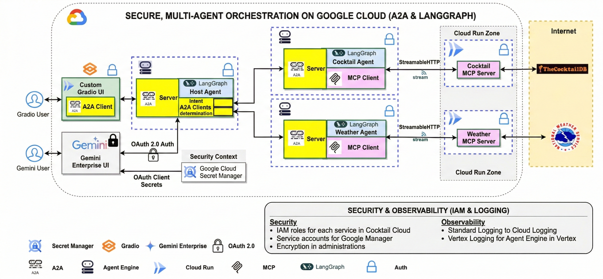

# A2A Multi-LangGraph-Agent on Agent Engine

This project demonstrates a multi-agent system using Agent2Agent (A2A), LangGraph, Vertex AI Agent Engine, MCP servers, and a CI/CD pipeline powered by GitHub Actions and Terraform.

## Overview

A web application demonstrating the integration of Google's Agent2Agent (A2A) protocol and LangGraph for multi-agent orchestration with Model Context Protocol (MCP) clients. A host agent coordinates tasks between specialized remote A2A agents that interact with MCP servers to fulfill user requests.

### Architecture

The application uses a multi-agent orchestrated architecture, leveraging Google’s Agent2Agent (A2A) protocol for secure communication and LangGraph for logic and routing. Authentication is enforced at every layer (indicated by padlock icons in the diagram).

**Component Breakdown & Data Flow:**

1.  **Frontend Layer**: Users can interact via a **Custom Gradio UI** (hosted on Cloud Run with an A2A Client) or the **Gemini Enterprise UI**.
2.  **Orchestration Layer (Host Agent)**: Running on an Agent Engine, the Host Agent acts as the central brain. It receives requests via its A2A Server, utilizes LangGraph for intent determination, and delegates tasks to specialized agents using A2A Clients.
3.  **Specialized Agents**:
    - **Cocktail Agent**: Receives sub-tasks via A2A, processes drink-related queries using LangGraph, and retrieves data using an **MCP Client**.
    - **Weather Agent**: Receives sub-tasks via A2A, processes weather-related reasoning using LangGraph, and retrieves data using an **MCP Client**.
4.  **Data Retrieval**: Specialized agents communicate with remote **MCP Servers** via StreamableHTTP to fetch real-world data from the public internet (TheCocktailDB and National Weather Service APIs).




### Security and Observability

The system is designed with a "Security-First" approach and comprehensive observability:

#### Security

- **Authentication (OAuth 2.0)**: Communication between the **Gemini Enterprise UI** and the **Host Agent** is secured via OAuth 2.0. This ensures that only authorized users can trigger orchestration workflows. OAuth credentials are a prerequisite for deployment.
- **Secret Management**: Sensitive information is never hardcoded. **Google Cloud Secret Manager** is used to securely store and manage:
  - **OAuth Client Secrets** (for Gemini UI to Host Agent communication).
  - **GitHub Token Credentials** (for CI/CD and repository interactions).
- **Identity & Access Management (IAM)**: Granular access control is enforced using Google Cloud IAM. Access to **remote agents** (Vertex AI Agent Engine) and **MCP servers** (Cloud Run) is restricted to specific service accounts with minimal necessary permissions:
  - `roles/run.invoker`: For calling MCP servers on Cloud Run.
  - `roles/aiplatform.user`: For interacting with remote A2A agents.
- **End-to-End Encryption**: All component-to-component communication (Frontend -> Host Agent -> Specialized Agents -> MCP Servers) is encrypted in transit via HTTPS/SSE.

#### Observability

- **Standardized Cloud Logging**: The system uses an explicit Google Cloud Logging integration via a shared [logging_utils.py](file:///usr/local/google/home/wangdave/remote_ws/projects/a2a-multiagent-langgraph-cicd/src/a2a_agents/common/logging_utils.py) utility. This replaces legacy `print()` statements and ensures that logs are captured with proper severity levels and structured specifically for **Google Cloud Logging**.
- **Centralized Monitoring**: All components (Frontend, Hosting Agent, and MCP Servers) leverage this utility to output logs that are automatically consolidated in the **Cloud Logging** dashboard. Each component uses a distinct `log_name` (e.g., `base-mcp-agent`, `frontend-app`) for easier filtering and monitoring.
- **Environment Control**: Integration can be toggled via `USE_CLOUD_LOGGING` (defaults to `TRUE`). It gracefully falls back to standard Python console logging in local development environments.
- **Execution Capture**: For specialized agents running on Agent Engine, execution logs are captured by the runtime environment and are accessible through the Vertex AI Logging interface.

### Application Screenshot


## Project Structure

```
.
├── src/
│   ├── a2a_agents/                     # A2A agent implementations
│   │   ├── common/                     # Shared base classes
│   │   ├── cocktail_agent/             # Cocktail specialist agent
│   │   ├── weather_agent/              # Weather specialist agent
│   │   └── hosting_agent/              # Orchestrator agent
│   ├── frontend/                       # Gradio web frontend
│   └── mcp_servers/                    # MCP server implementations
│       ├── cocktail_mcp_server/        # CocktailDB API wrapper
│       └── weather_mcp_server/         # Weather.gov API wrapper
├── deployment/
│   ├── deploy_agents.py                # Agent deployment script
│   └── terraform/                      # Infrastructure as code
├── tests/
│   ├── unit/                           # Unit tests (pytest)
│   ├── integration/                    # Integration tests
│   ├── eval/                           # ADK evaluation cases
│   └── load_test/                      # Load tests (Locust)
├── dev_notebooks/                      # Development & testing notebooks
├── .github/workflows/deploy.yml        # CI/CD pipeline
└── pyproject.toml                      # Project configuration
```

## Core Components

### Agents

| Agent              | Role         | Description                                                                                                                                                                         |
| ------------------ | ------------ | ----------------------------------------------------------------------------------------------------------------------------------------------------------------------------------- |
| **Hosting Agent**  | Orchestrator | Receives user queries, determines the required task, and delegates to the appropriate specialist agent via A2A `send_message`. Handles greetings and capability questions directly. |
| **Cocktail Agent** | Specialist   | Handles cocktail recipe and ingredient queries using the Cocktail MCP server.                                                                                                       |
| **Weather Agent**  | Specialist   | Handles weather forecast and alert queries using the Weather MCP server.                                                                                                            |

### MCP Servers and Tools

**Cocktail MCP Server** — wraps [TheCocktailDB](https://www.thecocktaildb.com/) API:

| Tool                                         | Description                    |
| -------------------------------------------- | ------------------------------ |
| `search_cocktail_by_name(name)`              | Search cocktails by name       |
| `list_cocktails_by_first_letter(letter)`     | List cocktails by first letter |
| `search_ingredient_by_name(name)`            | Search ingredient details      |
| `list_random_cocktails()`                    | Get a random cocktail          |
| `lookup_cocktail_details_by_id(cocktail_id)` | Full cocktail details by ID    |

**Weather MCP Server** — wraps [Weather.gov](https://www.weather.gov/) (NOAA) API:

| Tool                                | Description                           |
| ----------------------------------- | ------------------------------------- |
| `get_forecast_by_city(city, state)` | Weather forecast by city and US state |
| `get_forecast(latitude, longitude)` | Weather forecast by coordinates       |
| `get_active_alerts_by_state(state)` | Active weather alerts by state code   |

## Example Usage

```
Please get cocktail margarita id and then full detail of cocktail margarita
Please list a random cocktail
Please get weather forecast for New York
Please get weather forecast for 40.7128,-74.0060
Are there any weather alerts for Texas?
```

## Setup and Deployment

### Prerequisites

1. [Python 3.12+](https://www.python.org/downloads/)
2. [gcloud SDK](https://cloud.google.com/sdk/docs/install)
3. [uv](https://docs.astral.sh/uv/getting-started/installation/)
4. [Terraform](https://developer.hashicorp.com/terraform/downloads)
5. [GitHub CLI (gh)](https://cli.github.com/)
6. Create a Gemini Enterprise App and get the App ID.
7. Create OAuth credentials and save them in Google Cloud Secret Manager as "client_secret".

### Environment Variables for Local Testing

Before running locally, set up the following environment variables:

```bash
# Required: Google Cloud Configuration
export PROJECT_ID=YOUR_PROJECT_ID
export PROJECT_NUMBER=YOUR_PROJECT_NUMBER
export GOOGLE_CLOUD_REGION=us-central1

# Required: MCP Server URLs (after MCP servers are deployed)
export CT_MCP_SERVER_URL=https://cocktail-remote-mcp-server-lg-${PROJECT_NUMBER}.${GOOGLE_CLOUD_REGION}.run.app/mcp/
export WEA_MCP_SERVER_URL=https://weather-remote-mcp-server-lg-${PROJECT_NUMBER}.${GOOGLE_CLOUD_REGION}.run.app/mcp/

# Required: Python path for agent deployment
export PYTHONPATH=src
```

**How to find your values:**

- `PROJECT_ID`: Your Google Cloud project ID (e.g., `my-project`)
- `PROJECT_NUMBER`: Run `gcloud projects describe $PROJECT_ID --format="value(projectNumber)"`
- `GOOGLE_CLOUD_REGION`: The region where you deploy services (e.g., `us-central1`)

### CI/CD Setup

This project uses **GitHub Actions** for CI/CD with **Terraform** for infrastructure management and **Google Cloud Build** for container builds.

The workflow (`.github/workflows/deploy.yml`) triggers on pushes to:

- `staging` branch — deploys to the staging project
- `main` branch — deploys to the production project

**Pipeline steps** (each runs only when its source files change):

1. **Detect Changes** — uses `dorny/paths-filter` to identify which components changed
2. **Deploy MCP Servers** — builds and deploys Cocktail/Weather MCP servers to Cloud Run via Cloud Build
3. **Deploy Agents** — runs `deployment/deploy_agents.py` to deploy A2A agents to Vertex AI Agent Engine
4. **Deploy Frontend** — builds and deploys the Gradio frontend to Cloud Run via Cloud Build
5. **Apply Terraform** — updates Cloud Run service configuration and infrastructure

#### Option 1: Automated CI/CD Setup (Recommended)

Use the `agent-starter-pack` CLI tool to automatically configure GitHub Actions with Cloud Build:

1. **Authenticate with Google Cloud and GitHub:**

   ```bash
   gcloud auth login
   gcloud auth application-default login
   gh auth login
   ```

2. **Install the agent-starter-pack:**

   ```bash
   uvx agent-starter-pack setup-cicd \
     --dev-project YOUR_DEV_PROJECT_ID \
     --staging-project YOUR_STAGING_PROJECT_ID \
     --prod-project YOUR_PROD_PROJECT_ID \
     --repository-name YOUR_REPO_NAME \
     --repository-owner YOUR_GITHUB_USERNAME \
     --cicd-runner github_actions
   ```

   This command will:
   - Enable required Google Cloud APIs
   - Create Workload Identity Federation for GitHub Actions
   - Set up GitHub repository secrets
   - Configure Cloud Build triggers
   - Grant necessary IAM permissions

3. **Verify the setup:**
   - Check GitHub repository settings → Secrets and variables → Actions
   - Verify the following secrets are configured:
     - `GCP_PROJECT_ID_STAGING`
     - `GCP_PROJECT_NUMBER_STAGING`
     - `GCP_PROJECT_ID_PROD`
     - `GCP_PROJECT_NUMBER_PROD`
     - `WORKLOAD_IDENTITY_PROVIDER`
     - `SERVICE_ACCOUNT_EMAIL`

#### Option 2: Manual CI/CD Setup

If you prefer to set up CI/CD manually or need more control:

1. **Enable Required APIs:**

   ```bash
   gcloud services enable \
     cloudbuild.googleapis.com \
     run.googleapis.com \
     aiplatform.googleapis.com \
     artifactregistry.googleapis.com \
     iam.googleapis.com \
     iamcredentials.googleapis.com \
     --project YOUR_PROJECT_ID
   ```

2. **Create a Service Account for GitHub Actions:**

   ```bash
   export PROJECT_ID=YOUR_PROJECT_ID
   export SERVICE_ACCOUNT_NAME=github-actions-sa

   gcloud iam service-accounts create $SERVICE_ACCOUNT_NAME \
     --display-name="GitHub Actions Service Account" \
     --project=$PROJECT_ID
   ```

3. **Grant Required Permissions:**

   ```bash
   export PROJECT_NUMBER=$(gcloud projects describe $PROJECT_ID --format="value(projectNumber)")
   export SA_EMAIL=${SERVICE_ACCOUNT_NAME}@${PROJECT_ID}.iam.gserviceaccount.com

   # Grant Cloud Build, Cloud Run, and Vertex AI permissions
   gcloud projects add-iam-policy-binding $PROJECT_ID \
     --member="serviceAccount:${SA_EMAIL}" \
     --role="roles/cloudbuild.builds.builder"

   gcloud projects add-iam-policy-binding $PROJECT_ID \
     --member="serviceAccount:${SA_EMAIL}" \
     --role="roles/run.admin"

   gcloud projects add-iam-policy-binding $PROJECT_ID \
     --member="serviceAccount:${SA_EMAIL}" \
     --role="roles/aiplatform.admin"

   gcloud projects add-iam-policy-binding $PROJECT_ID \
     --member="serviceAccount:${SA_EMAIL}" \
     --role="roles/iam.serviceAccountUser"
   ```

4. **Set up Workload Identity Federation:**

   ```bash
   export REPO_OWNER=YOUR_GITHUB_USERNAME
   export REPO_NAME=YOUR_REPO_NAME

   # Create Workload Identity Pool
   gcloud iam workload-identity-pools create "github-pool" \
     --location="global" \
     --project=$PROJECT_ID

   # Create Workload Identity Provider
   gcloud iam workload-identity-pools providers create-oidc "github-provider" \
     --location="global" \
     --workload-identity-pool="github-pool" \
     --issuer-uri="https://token.actions.githubusercontent.com" \
     --attribute-mapping="google.subject=assertion.sub,attribute.actor=assertion.actor,attribute.repository=assertion.repository" \
     --project=$PROJECT_ID

   # Allow GitHub Actions to impersonate the service account
   export WORKLOAD_IDENTITY_POOL_ID=$(gcloud iam workload-identity-pools describe github-pool \
     --location=global --project=$PROJECT_ID --format="value(name)")

   gcloud iam service-accounts add-iam-policy-binding $SA_EMAIL \
     --role="roles/iam.workloadIdentityUser" \
     --member="principalSet://iam.googleapis.com/${WORKLOAD_IDENTITY_POOL_ID}/attribute.repository/${REPO_OWNER}/${REPO_NAME}" \
     --project=$PROJECT_ID
   ```

5. **Configure GitHub Secrets:**

   Go to your GitHub repository → Settings → Secrets and variables → Actions, and add:

   ```bash
   # For staging environment
   GCP_PROJECT_ID_STAGING=your-staging-project-id
   GCP_PROJECT_NUMBER_STAGING=your-staging-project-number

   # For production environment
   GCP_PROJECT_ID_PROD=your-prod-project-id
   GCP_PROJECT_NUMBER_PROD=your-prod-project-number

   # Workload Identity Federation
   WORKLOAD_IDENTITY_PROVIDER=projects/PROJECT_NUMBER/locations/global/workloadIdentityPools/github-pool/providers/github-provider
   SERVICE_ACCOUNT_EMAIL=github-actions-sa@PROJECT_ID.iam.gserviceaccount.com
   ```

6. **Test the Setup:**

   ```bash
   # Push to staging branch to trigger deployment
   git checkout staging
   git push origin staging

   # Monitor the GitHub Actions workflow
   gh run watch
   ```

### Manual Deployment / Local Development

For local development and testing without CI/CD:

1. **Authenticate and configure:**

   ```bash
   gcloud auth login
   gcloud auth application-default login
   gcloud config set project YOUR_PROJECT_ID
   uv sync
   ```

2. **Set environment variables** (see "Environment Variables for Local Testing" above):

   ```bash
   export PROJECT_ID=YOUR_PROJECT_ID
   export PROJECT_NUMBER=YOUR_PROJECT_NUMBER
   export GOOGLE_CLOUD_REGION=us-central1
   export PYTHONPATH=src
   ```

3. **Deploy MCP Servers to Cloud Run:**

   ```bash
   # Build and deploy Cocktail MCP Server
   gcloud builds submit ./src/mcp_servers/cocktail_mcp_server \
     --tag gcr.io/${PROJECT_ID}/cocktail-remote-mcp-server-lg

   gcloud run deploy cocktail-remote-mcp-server-lg \
     --image gcr.io/${PROJECT_ID}/cocktail-remote-mcp-server-lg \
     --platform managed \
     --region ${GOOGLE_CLOUD_REGION} \
     --allow-unauthenticated

   # Build and deploy Weather MCP Server
   gcloud builds submit ./src/mcp_servers/weather_mcp_server \
     --tag gcr.io/${PROJECT_ID}/weather-remote-mcp-server-lg

   gcloud run deploy weather-remote-mcp-server-lg \
     --image gcr.io/${PROJECT_ID}/weather-remote-mcp-server-lg \
     --platform managed \
     --region ${GOOGLE_CLOUD_REGION} \
     --allow-unauthenticated
   ```

4. **Update MCP Server URLs:**

   ```bash
   # Get the deployed URLs
   export CT_MCP_SERVER_URL=$(gcloud run services describe cocktail-remote-mcp-server-lg \
     --region ${GOOGLE_CLOUD_REGION} --format="value(status.url)")/mcp/

   export WEA_MCP_SERVER_URL=$(gcloud run services describe weather-remote-mcp-server-lg \
     --region ${GOOGLE_CLOUD_REGION} --format="value(status.url)")/mcp/

   echo "CT_MCP_SERVER_URL: $CT_MCP_SERVER_URL"
   echo "WEA_MCP_SERVER_URL: $WEA_MCP_SERVER_URL"
   ```

5. **Deploy A2A Agents to Vertex AI Agent Engine:**

   ```bash
   python deployment/deploy_agents.py
   ```

6. **Deploy Frontend to Cloud Run:**

   ```bash
   gcloud builds submit ./src/frontend \
     --tag gcr.io/${PROJECT_ID}/a2a-frontend-lg

   gcloud run deploy a2a-frontend-lg \
     --image gcr.io/${PROJECT_ID}/a2a-frontend-lg \
     --platform managed \
     --region ${GOOGLE_CLOUD_REGION} \
     --allow-unauthenticated
   ```

7. **Access the application:**
   ```bash
   # Get the frontend URL
   gcloud run services describe a2a-frontend-lg \
     --region ${GOOGLE_CLOUD_REGION} \
     --format="value(status.url)"
   ```

### Securing the Frontend

To restrict access to the frontend so only you can access it, you need to remove public access and grant invoker permissions to your Google account.

1. **Remove public access (Require Authentication):**

   ```bash
   gcloud run services remove-iam-policy-binding a2a-frontend-lg \
     --region=${GOOGLE_CLOUD_REGION} \
     --project=${PROJECT_ID} \
     --member="allUsers" \
     --role="roles/run.invoker"
   ```

2. **Grant access directly to your account:**
   ```bash
   gcloud run services add-iam-policy-binding a2a-frontend-lg \
     --region=${GOOGLE_CLOUD_REGION} \
     --project=${PROJECT_ID} \
     --member="user:YOUR_GOOGLE_EMAIL" \
     --role="roles/run.invoker"
   ```

**Note:** Once secured, standard browsing will result in a 403 Forbidden error. To access the secured frontend locally, use the Cloud Run proxy:

```bash
gcloud run services proxy a2a-frontend-lg \
  --region=${GOOGLE_CLOUD_REGION} \
  --project=${PROJECT_ID} \
  --port=8080
```

Then visit `http://localhost:8080` in your browser.

## Testing

### Install Dev Dependencies

```bash
pip install -e ".[dev]"
```

### Unit Tests

Unit tests cover both MCP servers with mocked external dependencies — no running services required.

```bash
pytest tests/unit/ -v
```

### Integration Tests

Integration tests require running MCP server instances. Set the server URLs via environment variables:

```bash
export COCKTAIL_MCP_URL=http://localhost:8080/mcp
export WEATHER_MCP_URL=http://localhost:8080/mcp
pytest -m integration -v
```

### Run All Tests (excluding integration)

```bash
pytest -m "not integration" -v
```

### Evaluation

ADK evaluation cases are in `tests/eval/`. See [`tests/eval/evalsets/README.md`](tests/eval/evalsets/README.md) for details on the 12 evaluation cases covering direct responses, tool use, orchestrator routing, and edge cases.

```bash
adk eval tests/eval/evalsets/basic.evalset.json --config tests/eval/eval_config.json
```

### Load Testing

Load tests use [Locust](https://locust.io/). See [`tests/load_test/README.md`](tests/load_test/README.md) for details.

### Development Notebooks

Interactive development and testing notebooks are in `dev_notebooks/`:

- `deploy_cocktail_langgraph_agent.ipynb` — Deploy cocktail agent
- `deploy_weather_langgraph_agent.ipynb` — Deploy weather agent
- `deploy_langgraph_host_agent.ipynb` — Deploy hosting agent
- `Langgraph+A2A+AE.ipynb` — End-to-end LangGraph + A2A demo

## Disclaimer

**Important**: The sample code provided is for demonstration purposes and illustrates the mechanics of the Agent-to-Agent (A2A) protocol. When building production applications, it is critical to treat any agent operating outside of your direct control as a potentially untrusted entity.

All data received from an external agent — including but not limited to its AgentCard, messages, artifacts, and task statuses — should be handled as untrusted input. Developers are responsible for implementing appropriate security measures, such as input validation and secure handling of credentials to protect their systems and users.

## License

This project is licensed under the [Apache License 2.0](LICENSE).
