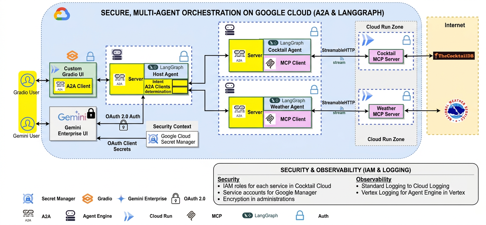
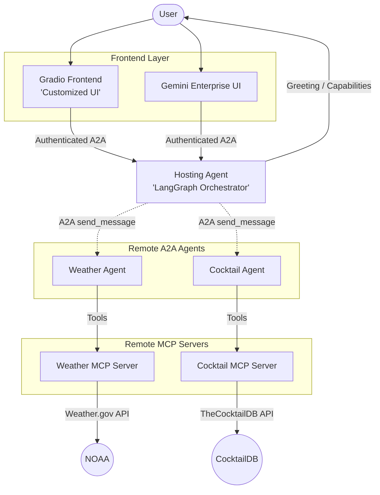

# A2A Multi-LangGraph-Agent on Agent Engine

A multi-agent system using Agent2Agent (A2A), LangGraph, Vertex AI Agent Engine, MCP servers, and a CI/CD pipeline powered by GitHub Actions and Terraform.

## Table of Contents

- [Architecture](#architecture)
- [Quick Start (Local)](#quick-start-local)
- [Full Local Setup (Without Docker)](#full-local-setup-without-docker)
- [Cloud Deployment](#cloud-deployment)
  - [Manual Deployment](#manual-deployment)
  - [CI/CD Setup](#cicd-setup)
- [Testing](#testing)
- [Observability](#observability)
- [Project Structure](#project-structure)
- [Additional Documentation](#additional-documentation)
- [Disclaimer](#disclaimer)

## Architecture

The Hosting Agent acts as a central orchestrator. It receives user requests via its A2A Server, uses LangGraph for intent routing, and delegates tasks to specialist agents (Weather, Cocktail) over A2A.





### Agents

| Agent              | Role         | Description                                                                                                |
| ------------------ | ------------ | ---------------------------------------------------------------------------------------------------------- |
| **Hosting Agent**  | Orchestrator | Routes user queries to the right specialist agent via A2A. Handles greetings and capability questions directly. |
| **Weather Agent**  | Specialist   | Answers weather forecast and alert queries using the Weather MCP server ([Weather.gov](https://www.weather.gov/) API). |
| **Cocktail Agent** | Specialist   | Answers cocktail recipe and ingredient queries using the Cocktail MCP server ([TheCocktailDB](https://www.thecocktaildb.com/) API). |

### MCP Server Tools

**Cocktail MCP Server:**

| Tool                                         | Description                    |
| -------------------------------------------- | ------------------------------ |
| `search_cocktail_by_name(name)`              | Search cocktails by name       |
| `list_cocktails_by_first_letter(letter)`     | List cocktails by first letter |
| `search_ingredient_by_name(name)`            | Search ingredient details      |
| `list_random_cocktails()`                    | Get a random cocktail          |
| `lookup_cocktail_details_by_id(cocktail_id)` | Full cocktail details by ID    |

**Weather MCP Server:**

| Tool                                | Description                           |
| ----------------------------------- | ------------------------------------- |
| `get_forecast_by_city(city, state)` | Weather forecast by city and US state |
| `get_forecast(latitude, longitude)` | Weather forecast by coordinates       |
| `get_alerts(state)`                 | Active weather alerts by state code   |

### Key Features

- **Multi-Agent Orchestration**: A2A protocol for secure agent-to-agent communication; LangGraph for reasoning and task execution.
- **Model Context Protocol (MCP)**: Streamable HTTP transport for standardized tool access from remote MCP servers.
- **Security**: OAuth 2.0 authentication, Google Cloud IAM (least privilege), Secret Manager for credentials, HTTPS end-to-end.
- **Multiple Frontends**: Custom Gradio UI (Cloud Run) and Gemini Enterprise UI.
- **Automated Infrastructure**: GitHub Actions + Terraform hybrid provisioning with Google Cloud Build.

---

## Quick Start (Local)

The fastest way to run the MCP servers and frontend locally using Docker Compose.

### Prerequisites

- [Docker](https://docs.docker.com/get-docker/) and Docker Compose
- [gcloud SDK](https://cloud.google.com/sdk/docs/install) (authenticated)
- A Google Cloud project with Vertex AI API enabled

### Steps

1. **Clone and configure:**

   ```bash
   git clone <repo-url>
   cd a2a-multiagent-langgraph-cicd

   # Copy the example env file and fill in your values
   cp .env.example .env
   ```

   Edit `.env` with your Google Cloud project details:
   ```bash
   PROJECT_ID=your-project-id
   PROJECT_NUMBER=your-project-number    # find via: gcloud projects describe $PROJECT_ID --format="value(projectNumber)"
   GOOGLE_CLOUD_LOCATION=us-central1
   AGENT_ENGINE_ID=projects/PROJECT_NUMBER/locations/REGION/reasoningEngines/AGENT_ID  # from deploy_agents.py output
   ```

2. **Authenticate with Google Cloud:**

   ```bash
   gcloud auth login
   gcloud auth application-default login
   gcloud config set project $PROJECT_ID
   ```

3. **Start the local stack:**

   ```bash
   make local-up
   # or: docker compose up --build
   ```

   This starts:
   | Service        | Local URL                    |
   | -------------- | ---------------------------- |
   | Cocktail MCP   | http://localhost:8081/mcp     |
   | Weather MCP    | http://localhost:8082/mcp     |
   | Frontend       | http://localhost:8080         |

4. **Stop the stack:**

   ```bash
   make local-down
   # or: docker compose down
   ```

### Example Queries

Once running, try these in the frontend:
```
Please get cocktail margarita id and then full detail of cocktail margarita
Please list a random cocktail
Please get weather forecast for New York
Please get weather forecast for 40.7128,-74.0060
Are there any weather alerts for Texas?
```

---

## Full Local Setup (Without Docker)

For development and running agents locally without Docker.

### Prerequisites

1. [Python 3.12+](https://www.python.org/downloads/)
2. [gcloud SDK](https://cloud.google.com/sdk/docs/install)
3. [uv](https://docs.astral.sh/uv/getting-started/installation/)
4. A Google Cloud project with Vertex AI API enabled

### Install Dependencies

```bash
uv sync              # core dependencies
uv sync --extra dev  # include test/dev tools (pytest, ruff, etc.)
```

### Environment Variables

```bash
cp .env.example .env
# Edit .env with your values, then:
export $(grep -v '^#' .env | xargs)

# Also set PYTHONPATH for agent imports
export PYTHONPATH=src
```

See [`.env.example`](.env.example) for all available variables and descriptions.

### Run MCP Servers Locally

Each MCP server can be run standalone for development:

```bash
# In separate terminals:
uv run python -m src.mcp_servers.cocktail_mcp_server.cocktail_server
uv run python -m src.mcp_servers.weather_mcp_server.weather_server
```

### Run Agents Locally

Agent executors start local A2A servers for testing:

```bash
# In separate terminals:
uv run python -m src.a2a_agents.weather_agent.agent_executor
uv run python -m src.a2a_agents.cocktail_agent.agent_executor
uv run python -m src.a2a_agents.hosting_agent.langgraph_orchestrator_agent_executor
```

---

## Cloud Deployment

### Manual Deployment

Deploy each component to Google Cloud without CI/CD.

**Additional prerequisites:** [Terraform](https://developer.hashicorp.com/terraform/downloads), [GitHub CLI (gh)](https://cli.github.com/), Gemini Enterprise App ID, OAuth credentials in Secret Manager as `client_secret`.

1. **Authenticate:**

   ```bash
   gcloud auth login
   gcloud auth application-default login
   gcloud config set project $PROJECT_ID
   ```

2. **Deploy MCP Servers to Cloud Run:**

   ```bash
   # Cocktail MCP Server
   gcloud builds submit ./src/mcp_servers/cocktail_mcp_server \
     --tag gcr.io/${PROJECT_ID}/cocktail-mcp-lg

   gcloud run deploy cocktail-mcp-lg-staging \
     --image gcr.io/${PROJECT_ID}/cocktail-mcp-lg \
     --platform managed \
     --region ${GOOGLE_CLOUD_REGION} \
     --allow-unauthenticated

   # Weather MCP Server
   gcloud builds submit ./src/mcp_servers/weather_mcp_server \
     --tag gcr.io/${PROJECT_ID}/weather-mcp-lg

   gcloud run deploy weather-mcp-lg-staging \
     --image gcr.io/${PROJECT_ID}/weather-mcp-lg \
     --platform managed \
     --region ${GOOGLE_CLOUD_REGION} \
     --allow-unauthenticated
   ```

3. **Deploy Agents to Vertex AI Agent Engine:**

   ```bash
   python deployment/deploy_agents.py
   ```

4. **Deploy Frontend to Cloud Run:**

   ```bash
   gcloud builds submit ./src/frontend \
     --tag gcr.io/${PROJECT_ID}/a2a-frontend-lg

   gcloud run deploy a2a-frontend-lg-staging \
     --image gcr.io/${PROJECT_ID}/a2a-frontend-lg \
     --platform managed \
     --region ${GOOGLE_CLOUD_REGION} \
     --allow-unauthenticated
   ```

#### Securing the Frontend

To restrict frontend access to specific users:

1. **Remove public access:**

   ```bash
   gcloud run services remove-iam-policy-binding a2a-frontend-lg-staging \
     --region=${GOOGLE_CLOUD_REGION} \
     --project=${PROJECT_ID} \
     --member="allUsers" \
     --role="roles/run.invoker"
   ```

2. **Grant access to your account:**

   ```bash
   gcloud run services add-iam-policy-binding a2a-frontend-lg-staging \
     --region=${GOOGLE_CLOUD_REGION} \
     --project=${PROJECT_ID} \
     --member="user:YOUR_GOOGLE_EMAIL" \
     --role="roles/run.invoker"
   ```

3. **Access via Cloud Run proxy** (after securing):

   ```bash
   gcloud run services proxy a2a-frontend-lg-staging \
     --region=${GOOGLE_CLOUD_REGION} \
     --project=${PROJECT_ID} \
     --port=8080
   ```

### CI/CD Setup

The project uses **GitHub Actions** for CI/CD with **Terraform** for infrastructure and **Google Cloud Build** for container builds.

#### How the Pipeline Works

The deployment pipeline (`.github/workflows/deploy.yml`) triggers on pushes to:

- `staging` branch → deploys to the staging environment
- `main` branch → deploys to the production environment

**Pipeline steps (Hybrid Provisioning):**

1. **Detect Changes** — identifies which components changed (MCP servers, agents, frontend, terraform).
2. **Build Images** — builds container images via Cloud Build.
3. **Terraform Apply (Phase 1)** — provisions Cloud Run services, Agent Engine shells, IAM, and networking.
4. **Deploy MCP Servers** — deploys Cocktail/Weather MCP servers to Cloud Run.
5. **Deploy Agents** — runs `deployment/deploy_agents.py` to deploy agents to Vertex AI Agent Engine.
6. **Deploy Frontend** — updates the Gradio frontend on Cloud Run.
7. **Terraform Apply (Phase 2)** — finalizes Gemini Enterprise OAuth and agent registration.

#### Option 1: Automated Setup (Recommended)

Use the `agent-starter-pack` CLI to configure GitHub Actions automatically:

```bash
gcloud auth login
gcloud auth application-default login
gh auth login

uvx agent-starter-pack setup-cicd \
  --dev-project YOUR_DEV_PROJECT_ID \
  --staging-project YOUR_STAGING_PROJECT_ID \
  --prod-project YOUR_PROD_PROJECT_ID \
  --repository-name YOUR_REPO_NAME \
  --repository-owner YOUR_GITHUB_USERNAME \
  --cicd-runner github_actions
```

#### Option 2: Manual Setup

<details>
<summary>Click to expand manual CI/CD setup steps</summary>

1. **Enable Required APIs:**

   ```bash
   gcloud services enable \
     cloudbuild.googleapis.com \
     run.googleapis.com \
     aiplatform.googleapis.com \
     artifactregistry.googleapis.com \
     iam.googleapis.com \
     iamcredentials.googleapis.com \
     --project $PROJECT_ID
   ```

2. **Create a Service Account for GitHub Actions:**

   ```bash
   export SERVICE_ACCOUNT_NAME=github-runner

   gcloud iam service-accounts create $SERVICE_ACCOUNT_NAME \
     --display-name="GitHub Actions Service Account" \
     --project=$PROJECT_ID
   ```

3. **Grant Required Permissions:**

   ```bash
   export PROJECT_NUMBER=$(gcloud projects describe $PROJECT_ID --format="value(projectNumber)")
   export SA_EMAIL=${SERVICE_ACCOUNT_NAME}@${PROJECT_ID}.iam.gserviceaccount.com

   for ROLE in roles/cloudbuild.builds.builder roles/run.admin roles/aiplatform.admin roles/iam.serviceAccountUser; do
     gcloud projects add-iam-policy-binding $PROJECT_ID \
       --member="serviceAccount:${SA_EMAIL}" \
       --role="$ROLE"
   done
   ```

4. **Set up Workload Identity Federation:**

   ```bash
   export REPO_OWNER=YOUR_GITHUB_USERNAME
   export REPO_NAME=YOUR_REPO_NAME

   gcloud iam workload-identity-pools create "github" \
     --location="global" \
     --project=$PROJECT_ID

   gcloud iam workload-identity-pools providers create-oidc "github-actions" \
     --location="global" \
     --workload-identity-pool="github" \
     --issuer-uri="https://token.actions.githubusercontent.com" \
     --attribute-mapping="google.subject=assertion.sub,attribute.actor=assertion.actor,attribute.repository=assertion.repository" \
     --project=$PROJECT_ID

   export WORKLOAD_IDENTITY_POOL_ID=$(gcloud iam workload-identity-pools describe github \
     --location=global --project=$PROJECT_ID --format="value(name)")

   gcloud iam service-accounts add-iam-policy-binding $SA_EMAIL \
     --role="roles/iam.workloadIdentityUser" \
     --member="principalSet://iam.googleapis.com/${WORKLOAD_IDENTITY_POOL_ID}/attribute.repository/${REPO_OWNER}/${REPO_NAME}" \
     --project=$PROJECT_ID
   ```

5. **Configure GitHub Environments and Variables:**

   Go to your GitHub repository **Settings > Environments**. Create `staging` and `production` environments. In each environment, add:

   | Variable                       | Value                                |
   | ------------------------------ | ------------------------------------ |
   | `PROJECT_ID`                   | Your GCP project ID                  |
   | `PROJECT_NUMBER`               | Your GCP project number              |
   | `REPOSITORY_OWNER`             | Your GitHub username                 |
   | `GE_APP_STAGING`               | Your Gemini Enterprise app name      |
   | `OAUTH_CLIENT_ID_SECRET_NAME`  | Your OAuth secret name               |
   | `AUTH_ID`                      | Your auth ID                         |

</details>

---

## Testing

Install dev dependencies first:

```bash
uv sync --extra dev
```

### Unit Tests

Unit tests mock all external dependencies — no running services required:

```bash
make test
# or: uv run pytest tests/unit/ -v
```

### Integration Tests

Integration tests require running MCP servers (e.g., via `make local-up`):

```bash
export CT_MCP_SERVER_URL=http://localhost:8081/mcp
export WEA_MCP_SERVER_URL=http://localhost:8082/mcp
export COCKTAIL_MCP_URL=http://localhost:8081/mcp
export WEATHER_MCP_URL=http://localhost:8082/mcp

make test-integration
# or: uv run pytest -m integration -v
```

### Evaluation

ADK evaluation cases are in `tests/eval/`. See [`tests/eval/evalsets/README.md`](tests/eval/evalsets/README.md) for the 12 evaluation cases covering direct responses, tool use, routing, and edge cases.

```bash
adk eval tests/eval/evalsets/basic.evalset.json --config tests/eval/eval_config.json
```

### Load Testing

Load tests use [Locust](https://locust.io/). See [`tests/load_test/README.md`](tests/load_test/README.md) for details.

### Linting & Formatting

```bash
make lint     # ruff check
make format   # ruff format
```

---

## Observability

- **Agents & Frontend**: Structured logging via `google-cloud-logging` SDK (falls back to console logging locally). Each component has a distinct `log_name` for filtering (e.g., `base-orchestrator-agent`, `base-mcp-agent`, `frontend-app`).
- **MCP Servers**: Standard Python `logging` — Cloud Run captures stdout/stderr automatically.
- **Dashboard**: All logs consolidated in the **Google Cloud Logging** console. Filter by `log_name` or Cloud Run service name.
- **Agent Engine**: Execution logs accessible through the Vertex AI Logging interface.

---

## Project Structure

```
.
├── src/
│   ├── a2a_agents/
│   │   ├── hosting_agent/              # Orchestrator (LangGraph-based routing)
│   │   │   ├── langgraph_orchestrator_agent.py
│   │   │   ├── langgraph_orchestrator_agent_executor.py
│   │   │   └── agent_engine_app.py     # Vertex AI Agent Engine entrypoint
│   │   ├── weather_agent/              # Weather specialist agent
│   │   │   ├── agent.py
│   │   │   ├── agent_executor.py       # Local A2A server for testing
│   │   │   └── agent_engine_app.py
│   │   ├── cocktail_agent/             # Cocktail specialist agent
│   │   │   ├── agent.py
│   │   │   ├── agent_executor.py
│   │   │   └── agent_engine_app.py
│   │   └── common/                     # Shared base classes & utilities
│   │       ├── langgraph_base_orchestrator_agent.py
│   │       ├── langgraph_base_mcp_agent.py
│   │       ├── remote_connection.py    # A2A client connection management
│   │       └── logging_utils.py        # Cloud Logging setup
│   ├── frontend/                       # Gradio web UI (Cloud Run)
│   │   ├── main.py
│   │   └── Dockerfile
│   └── mcp_servers/
│       ├── cocktail_mcp_server/        # TheCocktailDB API wrapper
│       │   ├── cocktail_server.py
│       │   └── Dockerfile
│       └── weather_mcp_server/         # Weather.gov API wrapper
│           ├── weather_server.py
│           └── Dockerfile
├── deployment/
│   ├── deploy_agents.py                # Python SDK agent deployment
│   ├── agent_state_manager.py          # Persists deployed agent IDs to GCS
│   └── terraform/                      # Infrastructure as Code
│       ├── cloudrun.tf                 # Cloud Run service definitions
│       ├── service.tf                  # Agent Engine reasoning engines
│       ├── iam.tf                      # IAM role bindings
│       ├── gemini_enterprise.tf        # Gemini Enterprise registration
│       └── deploy.sh                   # Terraform execution wrapper
├── tests/
│   ├── unit/                           # Mocked unit tests
│   ├── integration/                    # Live service integration tests
│   ├── eval/                           # ADK evaluation cases
│   └── load_test/                      # Locust load tests
├── .github/workflows/
│   ├── deploy.yml                      # CI/CD trigger (staging/main)
│   └── deploy-env.yml                  # Environment-specific deployment
├── docs/                               # Design docs and guides
├── dev_notebooks/                      # Development & registration scripts
├── .env.example                        # Environment variable template
├── docker-compose.yml                  # Local development stack
├── Makefile                            # Developer shortcuts
└── pyproject.toml                      # Dependencies & tool config
```

### Makefile Commands

| Command                | Description                              |
| ---------------------- | ---------------------------------------- |
| `make install`         | Install all dependencies (`uv sync`)     |
| `make test`            | Run unit tests                           |
| `make test-integration`| Run integration tests                    |
| `make lint`            | Lint with ruff                           |
| `make format`          | Format with ruff                         |
| `make local-up`        | Start local Docker Compose stack         |
| `make local-down`      | Stop local Docker Compose stack          |
| `make terraform-plan`  | Terraform plan (staging)                 |
| `make terraform-apply` | Terraform apply (staging)                |

---

## Additional Documentation

- **System Design & Architecture**: [`docs/software_design.md`](docs/software_design.md)
- **GitHub Actions Auth Guide**: [`docs/github-actions-wif-auth.md`](docs/github-actions-wif-auth.md)
- **Terraform Deployment Guide**: [`deployment/terraform/TERRAFORM_DEPLOYMENT_GUIDE.md`](deployment/terraform/TERRAFORM_DEPLOYMENT_GUIDE.md)
- **Testing Summary**: [`tests/TESTING_SUMMARY.md`](tests/TESTING_SUMMARY.md)
- **Dev Notebooks**: `dev_notebooks/`

## Disclaimer

**Important**: This sample code is for demonstration purposes and illustrates the mechanics of the Agent-to-Agent (A2A) protocol. When building production applications, treat any agent outside your direct control as a potentially untrusted entity.

All data received from an external agent — including its AgentCard, messages, artifacts, and task statuses — should be handled as untrusted input. Developers are responsible for implementing input validation and secure credential handling.

## License

[Apache License 2.0](LICENSE)
