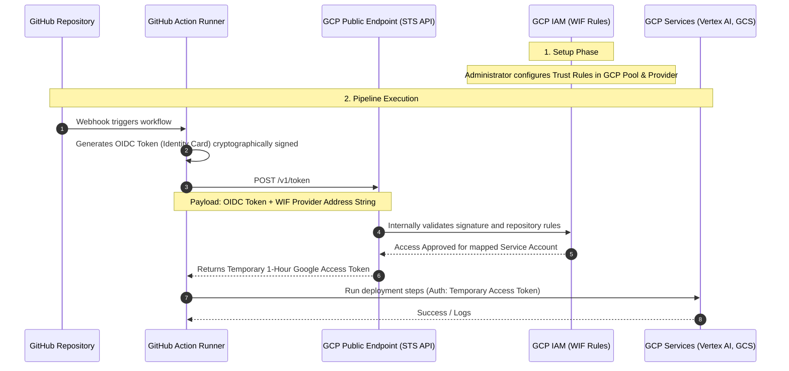

# How Authentication Works for GitHub Actions with Google Cloud

If you choose to use **GitHub Actions** instead of Google Cloud Build for your CI/CD pipeline, the modern and secure way to authenticate GitHub to Google Cloud is using **Workload Identity Federation (WIF)**. 

Using WIF, **no long-lived GCP credentials (like Service Account JSON keys) are ever saved in GitHub**. The entire process is fully automated for machine-to-machine authentication.

## 1. The Setup (Human Required)

A Cloud Administrator configures a trust relationship between GCP and GitHub ahead of time. You tell Google Cloud:
*"I authorize any GitHub Action running specifically in my repository (e.g., `wadave/a2a-multiagent-langgraph-cicd`) to act as a specific Service Account."*

You configure this by creating a **Workload Identity Pool** and **Provider** inside your GCP project.

- **What is saved in GCP:** The rules about what GitHub repositories are trusted and the cryptographic public keys needed to verify GitHub's tokens.
- **What is saved in GitHub:** Only the "address string" telling GitHub exactly which Workload Identity Pool and Provider to check in GCP (e.g., `projects/123.../locations/global/workloadIdentityPools/...`).

## 2. The Automated Run (Machine-to-Machine)

When a developer pushes code and triggers a GitHub Action, the pipeline does the following securely and autonomously:

1. **GitHub Asserts its Identity (OIDC Token):** 
   The Action runner creates an encrypted JSON Web Token (JWT), also known as an OIDC token. This token essentially says: *"I am a machine currently running a job for the approved repository."* Because this token is cryptographically signed by GitHub's private keys, nobody else can forge it.

2. **Knocking on the Public Door (STS API):**
   In your `.github/workflows/deploy.yml` file, you add an official authentication step provided by Google (`google-github-actions/auth`). This library sends a POST request across the public internet.
   - Google runs a standard, public API endpoint at `https://sts.googleapis.com/v1/token` (the Security Token Service API). 

3. **The Payload:**
   Included in that public API request to STS is:
   - The OIDC token dynamically generated by GitHub (proving it's your repo).
   - The address string telling Google exactly which saved WIF configuration rules to check inside GCP IAM.

4. **Internal Verification:**
   The public Google STS endpoint receives the request. It internally checks the cryptographic signature of the OIDC token against GitHub's public keys. It then internally checks the Workload Identity Pool rules saved in your private project's IAM configuration.

5. **The Response:**
   If everything passes, the public STS endpoint responds back over the open internet to the GitHub Action runner with a temporary Google Access Token (usually valid for 1 hour).

6. **Execution:**
   Subsequent steps in your GitHub Action (like downloading code, pushing to Artifact Registry, or deploying to Cloud Run) automatically use that temporary Google Access Token.

---

## Authentication Workflow Diagram

