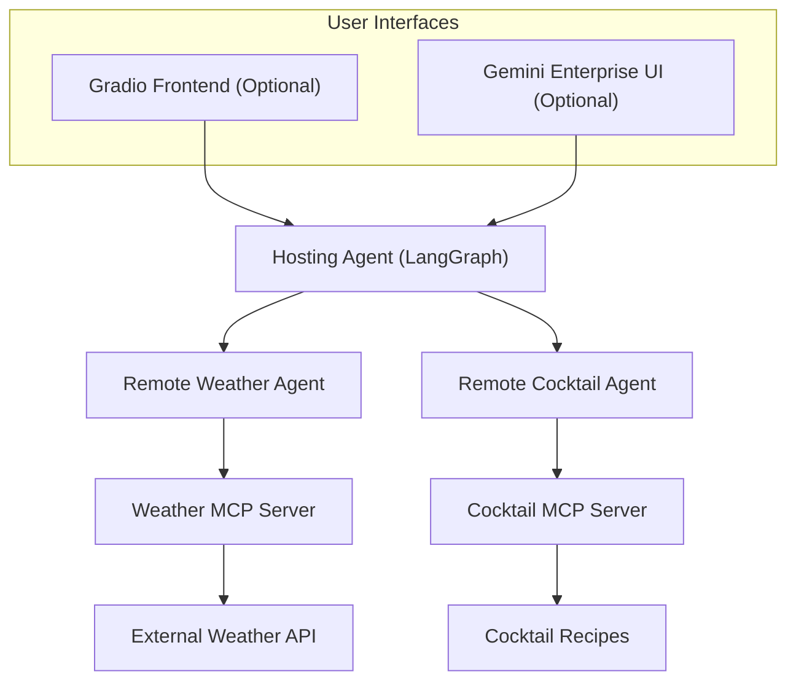

# Software Design Document - Multi-Agent LangGraph System

## Introduction

### Purpose

This document provides a detailed technical design for the Multi-Agent LangGraph System. It serves as a blueprint for developers, architects, and stakeholders to understand the system's architecture, components, security, and deployment strategy.

### Scope

The scope of this document covers the Hosting Agent (Orchestrator), specialized Remote Agents (Weather and Cocktail), the Model Context Protocol (MCP) integration, and the supporting infrastructure on Google Cloud.

### Acronyms and Definitions

- **A2A**: Agent-to-Agent communication protocol.
- **ADK**: Agent Development Kit (Google's framework for agentic systems).
- **MCP**: Model Context Protocol (standard for connecting AI models to tools).
- **IA**: Information Architecture.
- **GE**: Gemini Enterprise.

## System Overview

The Multi-Agent LangGraph System is a sophisticated AI application designed to provide specialized information (weather and cocktails) through a unified interface. It leverages a "Hosting Agent" that acts as an orchestrator, delegating user queries to specialized "Remote Agents" based on their capabilities.

### Key Design Goals

- **Modularity**: Specialized agents can be developed and deployed independently.
- **Extensibility**: New agents can be added by registering their Agent Cards with the Hosting Agent.
- **Security**: Robust authentication via OAuth 2.0 and identity-based access control.
- **Observability**: End-to-end logging for monitoring agent logic and tool usage.

## Architectural Design

### System Context

The system interacts with users via the Gemini Enterprise UI or a standalone Gradio frontend. It relies on Vertex AI for model hosting and Google Cloud for infrastructure.

### Component Interaction

1. **User** query enters the **Hosting Agent**.
2. **Hosting Agent** identifies the required capability and delegates to the appropriate **Remote Agent**.
3. **Remote Agent** uses its **MCP Server** tools to fetch data.
4. **Response** is bubbled back through the Hosting Agent to the **User**.

### Technology Stack

- **Core Framework**: Python 3.12+, LangGraph.
- **AI Models**: Gemini (Vertex AI).
- **Infrastructure**: Google Cloud (Cloud Run, Secret Manager, Cloud Logging).
- **Observability**: Google Cloud Logging SDK (`google-cloud-logging`).
- **Deployment**: Terraform, GitHub Actions.

## Detailed Design

### Hosting Agent (Orchestrator)

The Hosting Agent implements `LanggraphBaseOrchestratorAgent`. It uses:

- `A2ACardResolver`: To discover remote agents by fetching their JSON-based "Agent Cards".
- `RemoteAgentConnections`: To manage HTTP/JSON-RPC connections to remote services.
- **Delegation Logic**: Driven by LangGraph conditional edges, using tool calling to communicate with remote agents.

### Remote Agents

Specialized agents (Weather, Cocktail) inherited from `LanggraphBaseMCPAgent`. They:

- Expose an `/v1/card` endpoint for discovery.
- Use MCP protocols to interface with underlying tool servers.

### Base Classes (`src/a2a_agents/common`)

- `LanggraphBaseOrchestratorAgent`: Core logic for multi-agent coordination.
- `LanggraphBaseMCPAgent`: Template for agents using MCP tools.
- `RemoteAgentConnections`: Abstraction for A2A communication.

## External Interfaces

### User Interface

- **Gemini Enterprise UI**: Integrated tool for corporate users.
- **Gradio Frontend**: Lightweight UI for testing and development.

### Remote MCP Server Protocols

Communication between agents and tool servers follows the standard MCP specification over HTTP/SSE.

## Security Considerations

### Authentication & Authorization

- **OAuth 2.0**: Used for authenticating the Gemini UI to the Hosting Agent.
- **Secret Manager**: Secure storage for OAuth client IDs, secrets, and API keys.
- **IAM Roles**: Least-privilege roles provided to Cloud Run service accounts (`roles/run.invoker`, `roles/aiplatform.user`).

### Data Protection

- Sensitive configuration is never hardcoded.
- Input validation is performed at each agent boundary.

## Reliability & Observability

### Logging

- **Standard Logging**: Python `logging` module used throughout the codebase.
- **Explicit Cloud Logging**: The system integrates the `google-cloud-logging` SDK via a shared utility function `setup_cloud_logging`. This ensures logs are correctly structured and labeled within the Google Cloud console.
- **Idempotent Initialization**: The logging system uses a state-aware initialization pattern to prevent duplicate log handlers and ensuring consistent output even in multi-instantiated agent environments.
- **Traceability**: `context_id` and `task_id` are propagated across agent calls for request tracing.

## Deployment Architecture

### CI/CD Pipeline

GitHub Actions automates:

1. **Testing**: Running unit and evaluation tests on PRs.
2. **Infrastructure**: Running Terraform `plan`/`apply`.
3. **Deployment**: Building and pushing containers to Artifact Registry, then deploying to Cloud Run.

### Infrastructure as Code (IaC)

Terraform modules manage:

- Cloud Run services for all agents and MCP servers.
- Secret Manager versions.
- Gemini Enterprise registration.

## Testing Strategy

### Automated Tests

- **Unit Tests**: Found in `tests/unit`, verifying individual component logic.
- **Integration Tests**: Verifying communication between Hosting and Remote agents.
- **Evaluation Suite**: `tests/eval/run_evaluation.py` uses ADK evaluation patterns to score agent responses based on rubrics.

### Manual Verification

- Deployment to staging environment via `deploy_agents.py` and Terraform for final E2E validation.
